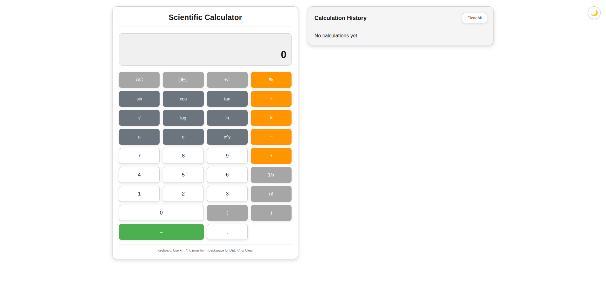
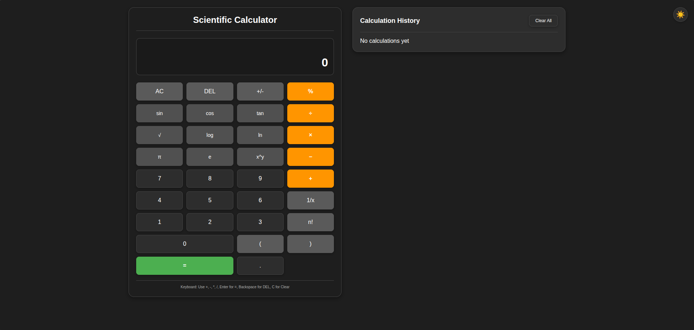
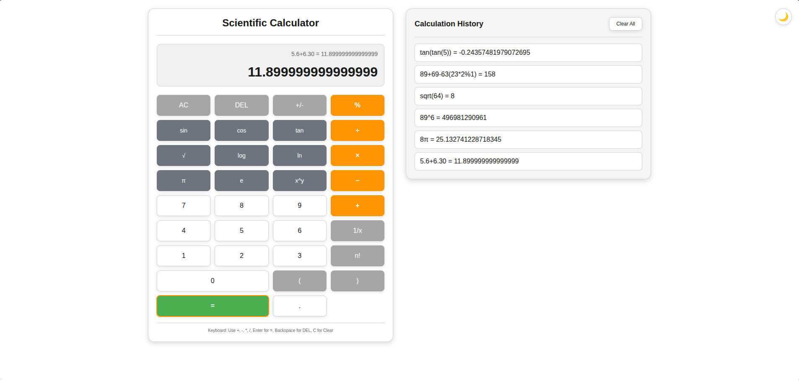

# TypeScript Calculator Assessment

A fully modular, browser-based **Scientific Calculator** built using modern Typescript . This project demonstrates strong understanding of advanced Typescript concepts including **Generics , Type Guards, Utility Types, Interfaces,etc.**.

---

## 📑 Table of Contents

- Overview
- Features
- Technologies Used
- Folder Structure
- Typescript Concepts Demonstrated
- How Expression Evaluation Works
- Error Handling
- How to Run
- License

---

# 📌 Overview

This Scientific Calculator is built with a focus on:

- Clean, maintainable Typescript code
- Robust expression evaluation (no eval)
- UI/UX responsiveness

It supports both **basic arithmetic** and **advanced scientific functions**.

---

# 🌟 Features

## 🔢 Basic Operations

- Addition (+)
- Subtraction (−)
- Multiplication (×)
- Division (÷)
- Modulus (%)
- Evaluate (=)

## 🔬 Scientific Functions

- sin(x), cos(x), tan(x)
- x^y (power)
- π, e
- Factorial

## 🖥 UI Features

- Responsive interface
- Expression & result display
- History panel
- Clear History
- Light/Dark theme toggle
- Keyboard support
- Localstorage persistence

---

# ⌨️ Keyboard Support

The calculator includes full keyboard support for faster and more convenient input.
The following keys are supported:

## 🔢 Number Keys (0–9)

All numeric keys can be used directly to enter numbers.

## ➕ Operators

The following operator keys work as expected:

- \+ (Addition)
- \- (Subtraction)
- \* (Multiplication)
- / (Division)
- % (Modulus)

## ↩️ Backspace

Backspace key deletes the last character from the current expression.

## 🧹 Clear Input

Press C or c to clear the entire input instantly.

## ✔️ Evaluate Expression

Press Enter to evaluate the current expression.

# 🧰 Technologies Used

- HTML5
- CSS3
- Typescript 4.9

---

# 🗂 Folder Structure

```
/ (project root)
├─ index.html
├─ package.json
├─ package-lock.json
├─ tsconfig.json
├─ tsconfig.build.json
├─ tsconfig.tsbuildinfo
├─ readme.md
├─ css/
│  └─ style.css
└─ js/
   ├─ script.js
src/
├─ index.ts
├─ types/
│  ├─ index.ts
│  ├─ IOperations.type.ts
│  ├─ IPostfixConversion.type.ts
│  ├─ IPostfixEvaluation.type.ts
│  ├─ IStack.type.ts
│  └─ ITokenizer.type.ts
└─ utils/
    ├─ Calculator.ts
    ├─ infixToPostfix.ts
    ├─ operations.ts
    ├─ postfixEvaluation.ts
    ├─ stack.ts
    └─ tokenizer.ts

```

---

## TypeScript features Demonstrated

This project includes several TypeScript patterns to improve correctness and maintainability:

- **Interfaces & Contracts:** modules expose interfaces such as `ITokenizer`, `IStack`, and `IPostfixEvaluation` to define clear contracts between components.
- **Type aliases & utility types:** central types like `TOperations` / `TFunctions` and utility types (`Omit`, etc.) describe operator/function shapes.
- **Generics:** `IStack<T>` enables reusable stack implementations for different value types while preserving type safety.
- **Union & literal types:** e.g. `Associativity = 'left' | 'right'` restricts allowed values and improves exhaustiveness checks.
- **Type guards:** runtime checks (helper functions) narrow types safely when parsing tokens (e.g. numeric vs operator tokens).
- **Module path aliases:** imports use `@/types` for clearer references (see `tsconfig.json` paths).

Recommended files to inspect for TypeScript usage:

- `src/types/*` — core type definitions
- `src/utils/tokenizer.ts` — token parsing + guards
- `src/utils/infixToPostfix.ts` — algorithm typing and operator handling
- `src/utils/postfixEvaluation.ts` — evaluation logic with typed execute functions

These TypeScript features help catch bugs early, document intent, and make refactors safer.

# ⚙️ Expression Evaluation Workflow

```
Infix Input → Tokenizer → Shunting Yard (Infix → Postfix) → Postfix Evaluation → Result
```

# 🔁 Shunting Yard Algorithm

The **Shunting Yard Algorithm** converts an **infix expression** (human-readable format) into **postfix notation (Reverse Polish Notation)**, which is easier to evaluate using a stack.

Example:

Infix: 3 + 4 _ 2  
Postfix: 3 4 2 _ +

---

## ⚙️ How It Works (Simplified)

The algorithm uses:

- Output Queue
- Operator Stack

Rules:

1. Numbers → go directly to output.
2. Operators → pushed to stack (respecting precedence).
3. `(` → pushed to stack.
4. `)` → pop operators until `(` is found.
5. After processing all tokens → pop remaining operators to output.

---

## 📊 Operator Precedence

| Operator | Precedence | Associativity |
| -------- | ---------- | ------------- |
| !        | Highest    | Right         |
| ^        | High       | Right         |
| \*, /, % | Medium     | Left          |
| +, −     | Low        | Left          |

---

## 🧪 Example with Parentheses

Infix: (3 + 4) _ 2  
Postfix: 3 4 + 2 _

---

## 🧠 Why Use It?

- Handles operator precedence correctly
- Supports parentheses
- Avoids using `eval()`
- Enables safe stack-based evaluation

## **Time Complexity:** O(n)

# 🛡 Error Handling

The calculator safely handles:

- Division by zero
- Invalid expressions
- Malformed input
- Scientific domain errors

---
## Prerequisites

- Node.js (16+ recommended)
- npm (bundled with Node.js)

## Installation

Follow the steps below to run the project locally.

### Clone the repository

Replace `<repo-url>` with the actual repository URL:

```bash
git clone https://github.com/ronaksharma-simform/calculator_assessment
```

Navigate into the project directory
cd calculator_assessment

Install dev dependencies:

```bash
npm install
```

## Available scripts

- `npm run build` — Compile TypeScript using `tsconfig.build.json`.
- `npm run watch` — Compile in watch mode.
- `npm run serve` — Serve project root (useful for quick HTML preview).
- `npm run serve:dist` — Serve the built `dist` folder.
- `npm start` — Build then serve `dist` (recommended for checking built output).

### Development workflow

1. Compile continuously while editing:

```bash
npm run watch
```

2. Open the app directly without building (serves project root):

```bash
npm run serve
# then open http://localhost:8080
```

3. To test the production build flow (compile, then serve `dist`):

```bash
npm start
# then open http://localhost:8080
```

If you prefer a different static server you can also use `npx http-server . -p 8080` or any other static server.

---

Files of interest:

- `src/` — TypeScript source
- `index.html` — Entry HTML
- `tsconfig.build.json` — build config
- `package.json` — npm scripts

If you want, I can run `npm install` now and start the server for you.

## Screenshots

### Light theme.



### Dark theme.



### History panel.



## 📌 Key Takeaways

This project demonstrates:

- Advanced understanding of expression parsing
- Data structure implementation (Stack)
- Algorithm implementation (Shunting Yard)
- Modular ES6 architecture
- Clean error handling strategy
- DOM event management
- Local storage state persistence

## Contributing

Contributions are welcome! You can:

- Fork the repository

- Create a new branch (git checkout -b feature/your-feature)
- Commit your changes (git commit -m "Add feature")

- Push to the branch (git push origin feature/your-feature)

- Open a Pull Request

## License

This project is for assessment purposes. Modify and use as needed.
